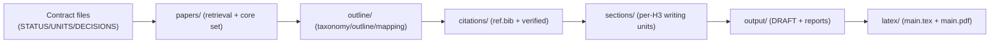

# research-units-pipeline-skills

A skills-first research pipeline skeleton: define workflows in `pipelines/*.pipeline.md`, execute via an auditable workspace contract (`UNITS.csv + CHECKPOINTS.md + DECISIONS.md`).

中文版本：[`README.md`](README.md).

## One-line activation (recommended: run the pipeline in chat)

Send this to Codex (or Claude Code):

> Write me an agent LaTeX survey
>

This should trigger skills routing and execute the pipeline, writing all intermediate artifacts into a workspace (`UNITS.csv` is the execution contract).

Optional:
- Specify the pipeline file: `pipelines/arxiv-survey-latex.pipeline.md`
- If you do NOT want auto-approval at C2, remove “auto-approve C2” from your prompt.

More explicit (less chance of wrong routing):

> Use `pipelines/arxiv-survey-latex.pipeline.md` to write me an agent LaTeX survey (strict quality gates; auto-approve C2)

## What you get (intermediate artifacts are visible)

- Workspace: `workspaces/<ws>/`
- Execution contract: `workspaces/<ws>/UNITS.csv` (one unit per row; run by dependencies)
- Human checkpoints: `workspaces/<ws>/DECISIONS.md` (by default, you approve C2 before prose)
- Main deliverable: `workspaces/<ws>/output/DRAFT.md` + `workspaces/<ws>/latex/main.pdf`
- If BLOCKED: `workspaces/<ws>/output/QUALITY_GATE.md` tells you exactly what failed and what to fix

## Example artifacts (v0.1, full intermediate outputs)

Path: `example/e2e-agent-survey-latex-verify-20260118-182656/` (pipeline: `pipelines/arxiv-survey-latex.pipeline.md`).
Config: `draft_profile: lite` / `evidence_mode: abstract` / `core_size: 220` (see `queries.md`).

Directory map (what each folder is for):

```text
example/e2e-agent-survey-latex-verify-20260118-182656/
  STATUS.md            # progress + run log (current checkpoint)
  UNITS.csv            # execution contract (deps / acceptance / outputs)
  DECISIONS.md         # human checkpoints (Approve C*)
  CHECKPOINTS.md       # checkpoint rules
  PIPELINE.lock.md     # selected pipeline (single source of truth)
  GOAL.md              # goal/scope seed
  queries.md            # retrieval + writing profile config (draft_profile/evidence_mode/core_size...)
  papers/              # C1/C3: retrieval outputs and paper “substrate”
  outline/             # C2/C3/C4: taxonomy/outline/mapping + briefs + evidence packs + tables/figures specs
  citations/           # C4: BibTeX + verification records
  sections/            # C5: per-H2/H3 writing units (incl. chapter leads)
  output/              # C5: merged DRAFT + reports (audit/merge/citation budget...)
  latex/               # C5: LaTeX scaffold + compiled PDF (main.pdf)
```

How folders connect (pipeline view):



If you only care about the final deliverables:
- Draft (Markdown): `example/e2e-agent-survey-latex-verify-20260118-182656/output/DRAFT.md`
- PDF: `example/e2e-agent-survey-latex-verify-20260118-182656/latex/main.pdf`
- QA report: `example/e2e-agent-survey-latex-verify-20260118-182656/output/AUDIT_REPORT.md`

## Star History

[](https://star-history.com/#WILLOSCAR/research-units-pipeline-skills&Date)
