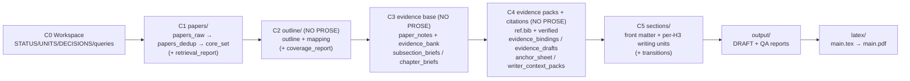

# research-units-pipeline-skills

> **In one sentence**: Make pipelines that can "guide humans / guide models" through research—not a bunch of scripts, but a set of **semantic skills**, where each skill knows "what to do, how to do it, when it's done, and what NOT to do."

---

## Todo
1. Add multi-CLI collaboration and multi-agent design (plug APIs into the right stages to replace or share the load of Codex execution).
2. Keep polishing writing skills to raise both the floor and ceiling of writing quality.
3. Complete the remaining pipelines; add more examples under `example/`.
4. Remove redundant intermediate content in pipelines, following Occam's razor: do not add entities unless necessary.

## Core Design: Skills-First + Resumable Units + Evidence First

Research workflows often drift toward one of two extremes:
- **scripts only**: it runs, but it is a black box (hard to debug or improve)
- **docs only**: it reads well, but execution still relies on ad-hoc judgment (easy to drift)

This repo turns “write a survey” into **small, auditable, resumable steps**, and writes intermediate artifacts to disk at every step.

1) **Skill = an executable playbook**
- Each skill states `inputs / outputs / acceptance / guardrails` (e.g., C2–C4 are **NO PROSE**).

2) **Unit = one resumable step**
- Each unit is one row in `UNITS.csv` (deps + inputs/outputs + DONE criteria).
- If a unit is BLOCKED, you fix the referenced artifact and resume from that unit (no full restart).

3) **Evidence first**
- C1 retrieves papers; C2 builds an outline and per-section paper pools; C3/C4 turn them into write-ready evidence + references; C5 writes and produces the final draft/PDF.

At a glance (what to look at first):

| If you need to... | Look at | Typical fix |
|---|---|---|
| expand coverage / get more papers | `queries.md` + `papers/retrieval_report.md` | add keyword buckets, raise `max_results`, import offline sets, snowball |
| fix outline or weak section pools | `outline/outline.yml` + `outline/mapping.tsv` | merge/reorder sections, raise `per_subsection`, rerun mapping |
| fix “evidence-thin” writing | `papers/paper_notes.jsonl` + `outline/evidence_drafts.jsonl` | improve notes/packs first, then write |
| reduce templated voice / redundancy | `output/WRITER_SELFLOOP_TODO.md` + `output/PARAGRAPH_CURATION_REPORT.md` + `sections/*` | targeted rewrites + best-of-N candidates + paragraph fusion, then rerun gates |
| boost global unique citations | `output/CITATION_BUDGET_REPORT.md` + `citations/ref.bib` | in-scope injection (NO NEW FACTS) |

Chinese version: [`README.md`](README.md).

## Codex Reference Config

```toml

[sandbox_workspace_write]
network_access = true

[features]
unified_exec = true
shell_snapshot = true
steer = true
```

## 30-second quickstart (0 to PDF)

1) Start Codex in this repo directory:

```bash
codex --sandbox workspace-write --ask-for-approval never
```

2) Say one sentence in chat (example):

> Write a survey about LLM agents and output a PDF (show me the outline first)

3) What happens next (plain English):
- It creates a new timestamped folder under `workspaces/` and puts everything there.
- It first prepares an outline and a per-section reading list, then pauses for your OK.
- Reply “Looks good. Continue.” to start writing and generate the PDF.

4) Three files you will open most:
- Draft (Markdown): `workspaces/<...>/output/DRAFT.md`
- PDF: `workspaces/<...>/latex/main.pdf`
- QA report: `workspaces/<...>/output/AUDIT_REPORT.md`

5) If it stops unexpectedly, check:
- `workspaces/<...>/output/QUALITY_GATE.md` (why it stopped and what to fix next)
- `workspaces/<...>/output/RUN_ERRORS.md` (run/script errors)

Optional (more control):
- Pin the pipeline explicitly: `pipelines/arxiv-survey-latex.pipeline.md` (use this if you want a PDF)
- If you want a full end-to-end run without pausing at the outline, say it in your prompt (“auto-approve the outline”).

The “detailed walkthrough” below explains intermediate artifacts and the writing iteration loop.

## Detailed walkthrough: 0 to PDF

```
You:
  Write a LaTeX survey about LLM agents (strict; show me the outline first)

[C0-C1] Find papers
  - Retrieve candidates: `max_results=1800` per bucket; dedup target >=1200
  - Approach (short): split the topic into multiple query buckets (synonyms/acronyms/subtopics),
    retrieve them separately, then deduplicate into one pool.
    If the pool is too small or too noisy, rewrite keywords, add exclusions, and optionally raise `max_results` and rerun.
  - Output: `papers/core_set.csv` (default 300) + `papers/retrieval_report.md`

[C2] Outline review (no prose; the run pauses here by default)
  - You mainly review:
    - `outline/outline.yml`
    - `outline/mapping.tsv` (default 28 papers per subsection)
    - (optional) `outline/coverage_report.md` (coverage/reuse warnings)

You:
  Looks good. Continue.
  (If you want a full end-to-end run, say “auto-approve the outline” in the first prompt.)

[C3-C4] Turn papers into write-ready material (no prose)
  - `papers/paper_notes.jsonl`: what each paper did/found + limitations
  - `citations/ref.bib`: the reference list (citation keys you can use)
  - `outline/writer_context_packs.jsonl`: per-section writing packs
    (what to compare + which citations are in scope)

[C5] Write and output (all iterations stay inside C5)
  1) Draft per-section files: `sections/*.md`
     (front matter + chapter leads + subsection bodies)
  2) Iterate with four “check + converge” gates (fix only what fails):
     - writer gate: `output/WRITER_SELFLOOP_TODO.md`
       (missing thesis/contrasts/eval anchors/limitations; remove templates)
     - paragraph logic gate: `output/SECTION_LOGIC_REPORT.md`
       (bridges + ordering; eliminate “paragraph islands”)
     - argument/consistency gate: `output/ARGUMENT_SELFLOOP_TODO.md`
       - single source of truth: `output/ARGUMENT_SKELETON.md`
     - paragraph curation gate: `output/PARAGRAPH_CURATION_REPORT.md`
       (best-of-N → select/fuse; avoid “keeps getting longer”)
  3) De-template pass (after convergence):
     - `style-harmonizer` + `opener-variator` (best-of-N)
  4) Merge into the draft and run final checks: `output/DRAFT.md`
     - If citations are low: `output/CITATION_BUDGET_REPORT.md`
       → `output/CITATION_INJECTION_REPORT.md`
     - Final audit: `output/AUDIT_REPORT.md`
     - LaTeX pipeline also compiles: `latex/main.pdf`

Target:
  - Global unique citations recommended `>=165`

If it gets blocked:
  - strict mode: read `output/QUALITY_GATE.md`
  - run/script errors: read `output/RUN_ERRORS.md`

You:
  Fix the referenced file, say “continue”
  → resume from the blocked step (no full restart)
```

**Key principle**: C2–C4 enforce NO PROSE—build the evidence base first; C5 writes prose; failures are point-fixable.

## Example Artifacts (v0.1, full intermediate outputs)

This is a fully-run example workspace: find papers → draft outline → build evidence → write → compile PDF. It includes all intermediate artifacts so you can learn the workflow by inspection.

- Example path: `example/e2e-agent-survey-latex-verify-<TIMESTAMP>/` (pipeline: `pipelines/arxiv-survey-latex.pipeline.md`)
- It pauses at **C2 (outline review)** before writing any prose
- Default posture (A150++): 300 core papers, 28 mapped papers per subsection, abstract-level evidence by default; the goal is to keep citation coverage high across the full draft
- Recommended: `draft_profile: survey` (default deliverable) or `draft_profile: deep` (stricter)

Directory quick glance (what each folder is for):

```text
example/e2e-agent-survey-latex-verify-<LATEST_TIMESTAMP>/
  STATUS.md            # progress + run log (current checkpoint)
  UNITS.csv            # execution contract (deps / acceptance / outputs)
  DECISIONS.md         # human checkpoints (Approve C*)
  CHECKPOINTS.md       # checkpoint rules
  PIPELINE.lock.md     # selected pipeline (single source of truth)
  GOAL.md              # goal/scope seed
  queries.md           # retrieval + writing profile config
  papers/              # C1/C3: retrieval outputs + paper notes/evidence base
  outline/             # C2/C3/C4: outline/mapping + briefs + evidence packs
  citations/           # C4: BibTeX + verification records
  sections/            # C5: per-H2/H3 writing units (incl. chapter leads)
  output/              # C5: merged DRAFT + reports
  latex/               # C5: LaTeX scaffold + compiled PDF
```

Pipeline view (how folders connect):



For delivery, focus on the **latest timestamped** example directory (keep 2–3 older runs for regression):

- Draft (Markdown): `example/e2e-agent-survey-latex-verify-<LATEST_TIMESTAMP>/output/DRAFT.md`
- PDF output: `example/e2e-agent-survey-latex-verify-<LATEST_TIMESTAMP>/latex/main.pdf`
- QA / audit report: `example/e2e-agent-survey-latex-verify-<LATEST_TIMESTAMP>/output/AUDIT_REPORT.md`

## Feel Free to Open Issues (Help Improve the Writing Workflow)

## Star History

[](https://star-history.com/#WILLOSCAR/research-units-pipeline-skills&Date)
