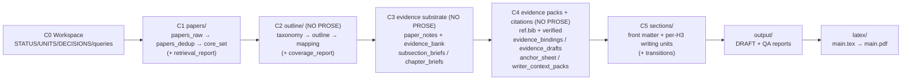

# research-units-pipeline-skills

> **一句话**：让 Pipeline 会"带人 / 带模型"做研究——不是给一堆脚本，而是给一套**语义化的 skills**，每个 skill 知道"该做什么、怎么做、做到什么程度、不能做什么"。

## WIP
1. best of N 写作
## Todo
1. 加入多 cli 协作，multi-agent design （在合适的环节接入 API，替代或者分担 codex 执行过程中的压力）
2. 完善剩余的Pipeline，example 新增例子
3. 精简Pipeline中冗余的中间内容，遵循优雅的奥卡姆剃刀原则，如无必要，勿增实体。


## 核心设计：Skills-First + 拆解链路 + 证据先行

这类工作最容易陷入两种极端：
- **只有脚本**：能跑，但失败时很难知道“该改哪里”。
- **只有文档**：看起来都对，但执行时仍靠经验，容易漂移。

本仓库的做法：把“写一篇 survey”拆成一串**可验收、可恢复**的小步，并把每一步的中间产物写到磁盘上。

1) **Skill：带验收的步骤说明书**
- 每个 skill 都写清楚 `inputs / outputs / acceptance / guardrail`：需要什么、产出什么、做到什么程度、哪些行为禁止（例如 C2–C4 **NO PROSE**）。

2) **Unit：一次运行里的一个小任务**
- `UNITS.csv` 一行一个 unit（依赖 + 输入/输出 + 验收）。
- 卡住时看报告定位到具体文件；修完从卡住的 unit 继续，不需要全重跑。

3) **证据先行：先准备“可写材料”，再写作**
- C1 找论文 → C2 定结构 → C3/C4 做证据与引用 → C5 写作/合并/审计/出 PDF。

一眼看懂（你想解决什么，就先看哪里）：

| 你想解决的问题 | 优先看哪里 | 常见修复动作 |
|---|---|---|
| 论文太少 / 覆盖不足 | `queries.md` + `papers/retrieval_report.md` | 扩关键词桶、提高 `max_results`、导入离线集合、做 snowball |
| 大纲不稳 / 小节没论文可写 | `outline/outline.yml` + `outline/mapping.tsv` | 合并/重排小节、提高 `per_subsection`、重跑 mapping |
| 证据薄导致写作空洞 | `papers/paper_notes.jsonl` + `outline/evidence_drafts.jsonl` | 补 notes / 补 evidence packs（先补证据，再写作） |
| 写作出现模板话/口癖/越写越冗余 | `output/WRITER_SELFLOOP_TODO.md` + `output/PARAGRAPH_CURATION_REPORT.md` + `sections/*` | 定点改写（并行候选→择优融合；去旁白/去导航/融合冗余段），再跑自检门 |
| 引用密度不够（unique 偏低） | `output/CITATION_BUDGET_REPORT.md` + `citations/ref.bib` | 按预算做 in-scope 注入（NO NEW FACTS） |


English version: [`README.en.md`](README.en.md).
skills index []

## codex 参考配置
配置可能会根据 codex 的更新有变化
```toml

[sandbox_workspace_write]
network_access = true

[features]
shell_snapshot = true
```


## 30 秒上手（从 0 到 PDF）

1) 在本仓库目录启动 Codex：

```bash
codex --sandbox workspace-write --ask-for-approval never
```

2) 在对话里说一句话（例子）：

> 帮我写一篇关于 LLM agents 的 LaTeX survey

3) 接下来会发生什么：
- 它会在 `workspaces/` 下新建一个带时间戳的文件夹，把所有结果都放进去。
- 它会先给你一份“大纲 + 每个小节要参考哪些论文”，然后停下来等你确认。
- 你回复“同意继续”，它才会开始写正文，并在最后生成 PDF。

4) 跑完后你最常看的 3 个文件：
- 草稿（Markdown）：`workspaces/<…>/output/DRAFT.md`
- PDF：`workspaces/<…>/latex/main.pdf`
- 质量报告：`workspaces/<…>/output/AUDIT_REPORT.md`

5) 如果卡住了，先看这两个文件：
- `workspaces/<…>/output/QUALITY_GATE.md`（为什么停、下一步该改什么）
- `workspaces/<…>/output/RUN_ERRORS.md`（脚本/缺文件等运行问题）

备注（可选，但更稳）：
- 你可以显式指定跑哪条流程：`pipelines/arxiv-survey-latex.pipeline.md`（需要 PDF 就用它）
- 想一次跑完（不在大纲处停）：请在那句话里补一句类似“跳过大纲确认 / 自动同意大纲 / 无需停在 outline 处确认，直接继续执行到成稿”的指令。

下面的“详细版”会解释每一步会产出哪些中间文件，以及写作阶段如何逐步润色与收敛。

## 详细版：对话式执行（从 0 到 PDF）

```
你：
  写一篇关于 LLM agents 的 LaTeX survey（严格；先给我大纲确认）

[C0-C1] 找论文
  - 检索候选：`max_results=1800`/桶；去重后目标 >=1200
  - 做法（简述）：通常会把主题拆成几条检索式（同义词/缩写/子方向）分别抓取，再统一去重。
    如果结果太少/噪声太大，就改写关键词、加排除词，必要时提高 `max_results` 再跑一次。
  - 产物：`papers/core_set.csv`（默认 300 篇）+ `papers/retrieval_report.md`

[C2] 给你看大纲（不写正文；默认会停在这里等你确认）
  - 你主要看：
    - `outline/outline.yml`
    - `outline/mapping.tsv`（每个小节默认映射 28 篇）
    - （可选）`outline/coverage_report.md`（覆盖率/重复引用预警）

你：
  同意继续
  （如果你想一次跑完：也可以在第一句话里说“自动同意大纲/跳过大纲确认”）

[C3-C4] 把论文整理成“可写材料”（不写正文）
  - `papers/paper_notes.jsonl`：每篇论文的要点/结果/局限
  - `citations/ref.bib`：参考文献表（正文里能引用的 key）
  - `outline/writer_context_packs.jsonl`：每个小节的写作包
    （该写哪些对比点 + 能用哪些引用）

[C5] 写作与输出（都在 C5 内反复迭代）
  1) 先写分小节文件：`sections/*.md`
     （摘要/引言/相关工作 + 章节导语 + 各小节正文）
  2) 再做“自检 + 收敛”（只修失败项，逐步润色）：
     - 写作门：`output/WRITER_SELFLOOP_TODO.md`
       （补结论句/对比/评测锚点/局限；去模板开头）
     - 段落逻辑门：`output/SECTION_LOGIC_REPORT.md`
       （补桥接、重排段落，消灭“段落孤岛”）
     - 论证与口径门：`output/ARGUMENT_SELFLOOP_TODO.md`
       - 口径单一真源：`output/ARGUMENT_SKELETON.md`
     - 选段融合收敛：`output/PARAGRAPH_CURATION_REPORT.md`
       （多候选→择优/融合，防止“越写越长”）
  3) 去口癖/去模板化（收敛后再做）：
     - `style-harmonizer` + `opener-variator`（best-of-N）
  4) 合并成草稿并做终稿检查：`output/DRAFT.md`
     - 如果引用不够：`output/CITATION_BUDGET_REPORT.md`
       → `output/CITATION_INJECTION_REPORT.md`
     - 最终审计：`output/AUDIT_REPORT.md`
     - LaTeX pipeline 还会生成：`latex/main.pdf`

目标：
  - 全局 unique citations 推荐 `>=165`（不足会触发“引用预算/注入”补齐）

如果卡住了：
  - strict 拦住：看 `output/QUALITY_GATE.md`（最后一条就是原因 + 下一步）
  - 运行问题：看 `output/RUN_ERRORS.md`

你：
  按报告修复对应文件后说「继续」
  → 从卡住的那一步继续跑，不需要全部重跑
```

**关键原则**：C2-C4 强制 NO PROSE，先建证据底座；C5 才写作，失败时可定点修复中间产物。

## 示例产物（v0.1，包含完整中间产物）
这是一个“完整跑通”的示例 workspace：从找论文 → 出大纲 → 整理证据 → 写草稿 → 编译 PDF，所有中间产物都在里面，方便你对照理解整条链路。

- 示例路径：`example/e2e-agent-survey-latex-verify-<时间戳>/`（对应流程：`pipelines/arxiv-survey-latex.pipeline.md`）
- 过程中会在 **C2（大纲）** 停下来等你确认；确认后才会写正文
- 默认配置（A150++）：核心论文 300 篇、每个小节映射 28 篇、证据模式用 abstract（摘要级）；目标是全局引用足够密（全局 unique citations 默认收敛到推荐值）
- 一般建议：`draft_profile: survey`（默认交付）；想更严格再用 `draft_profile: deep`

目录速览（每个文件夹干嘛用）：

```text
example/e2e-agent-survey-latex-verify-<最新时间戳>/
  STATUS.md            # 进度与执行日志（当前 checkpoint）
  UNITS.csv            # 执行合约：一行一个 unit（依赖/验收/产物）
  DECISIONS.md         # 人类检查点（Approve C*）
  CHECKPOINTS.md       # checkpoint 规则
  PIPELINE.lock.md     # 选中的 pipeline（单一真相源）
  GOAL.md              # 目标/范围 seed
  queries.md            # 检索与写作档位配置（draft_profile/evidence_mode/core_size...）
  papers/              # C1/C3：检索结果与论文“底座”
  outline/             # C2/C3/C4：taxonomy/outline/mapping + briefs + evidence packs + tables/figures 规格
  citations/           # C4：BibTeX 与 verification 记录
  sections/            # C5：按 H2/H3 拆分的可 QA 小文件（含 chapter lead）
  output/              # C5：合并后的 DRAFT + 报告（audit/merge/citation budget...）
  latex/               # C5：LaTeX scaffold + 编译产物（main.pdf）
```

文件夹之间的“流水线关系”：



交付时只关注**最新时间戳**的示例目录（默认保留 2–3 个历史目录用于回归对比）：

- Markdown 草稿：`example/e2e-agent-survey-latex-verify-<最新时间戳>/output/DRAFT.md`
- PDF 输出：`example/e2e-agent-survey-latex-verify-<最新时间戳>/latex/main.pdf`
- QA 审计报告：`example/e2e-agent-survey-latex-verify-<最新时间戳>/output/AUDIT_REPORT.md`


## 欢迎提出各类 issue，一起改进写作流程

## Star History

[](https://star-history.com/#WILLOSCAR/research-units-pipeline-skills&Date)
