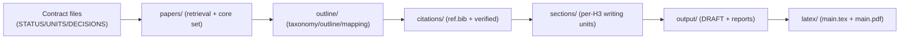

# research-units-pipeline-skills

一个 skills-first 的研究流水线骨架：用 `pipelines/*.pipeline.md` 定义流程，用 workspace 下的 `UNITS.csv + CHECKPOINTS.md + DECISIONS.md` 做执行合约（可见、可审计、可自循环）。

English version: [`README.en.md`](README.en.md).

## 一句话启用（推荐：对话里跑 Pipeline）

把下面这句话丢给 Codex（或 Claude Code）即可：

> 给我写一个 agent 的 latex-survey
>

这句话会触发 repo 内的 skills 自动路由并执行 pipeline（按 `UNITS.csv` 合同落盘中间产物）。

（可选：指定 pipeline 文件：`pipelines/arxiv-survey-latex.pipeline.md`（或 `research-units-pipeline-skills/pipelines/arxiv-survey-latex.pipeline.md`）；不想自动同意 C2：把“C2 自动同意”删掉即可。）

你也可以更明确一点（避免 router 选错）：

> 用 `pipelines/arxiv-survey-latex.pipeline.md` 给我写一个 agent 的 latex-survey（启用 strict 质量门；C2 自动同意）

## 你会得到什么（中间产物可见）

- Workspace：`workspaces/<ws>/`
- 执行合约：`workspaces/<ws>/UNITS.csv`（一行一个 unit；按依赖执行）
- 人类检查点：`workspaces/<ws>/DECISIONS.md`（默认 C2 需要你勾选 `Approve C2` 才进入写作）
- 主产物：`workspaces/<ws>/output/DRAFT.md` + `workspaces/<ws>/latex/main.pdf`
- 若 BLOCKED：`workspaces/<ws>/output/QUALITY_GATE.md` 会写明卡在哪个环节、应该改哪个中间产物（按 skills 合同）

## 样例教程（对话版：从 0 到 PDF）

1. 你：`给我写一个 agent 的 latex-survey`
2. 模型：初始化 workspace，跑到 C2（大纲/范围）停下
3. 你：`C2 同意，继续`
4. 模型：继续跑；如果薄/空洞会被质量门拦下并落盘 `output/QUALITY_GATE.md`
5. 你（如果 BLOCKED）：按 `output/QUALITY_GATE.md` 修对应中间产物，然后说：`继续`
6. 写作层面的常用自循环入口（只改失败小节）：
   - `workspaces/<ws>/output/SECTION_LOGIC_REPORT.md`（thesis + 连接词密度）
   - `workspaces/<ws>/output/CITATION_BUDGET_REPORT.md`（每个 H3 的 in-scope 引用增密建议）

## 你只需要记住的 3 个入口

- Pipeline：`pipelines/`
- Skills 索引：`SKILL_INDEX.md`
- 质量门/问题清单：`PIPELINE_DIAGNOSIS_AND_IMPROVEMENT.md` + `question.md`

## 示例产物（v0.1，包含完整中间产物）

路径：`example/e2e-agent-survey-latex-verify-20260118-182656/`（pipeline：`pipelines/arxiv-survey-latex.pipeline.md`）。
配置摘要：`draft_profile: lite` / `evidence_mode: abstract` / `core_size: 220`（详见 `queries.md`）。

目录速览（每个文件夹干嘛用）：

```text
example/e2e-agent-survey-latex-verify-20260118-182656/
  STATUS.md            # 进度与执行日志（当前 checkpoint）
  UNITS.csv            # 执行合约：一行一个 unit（依赖/验收/产物）
  DECISIONS.md         # 人类检查点（Approve C*）
  CHECKPOINTS.md       # checkpoint 规则
  PIPELINE.lock.md     # 选中的 pipeline（单一真相源）
  GOAL.md              # 目标/范围 seed
  queries.md            # 检索与写作档位配置（draft_profile/evidence_mode/core_size...）
  papers/              # C1/C3：检索结果与论文“底座”
  outline/             # C2/C3/C4：taxonomy/outline/mapping + briefs + evidence packs + tables/figures 规格
  citations/           # C4：BibTeX 与 verification 记录
  sections/            # C5：按 H2/H3 拆分的可 QA 小文件（含 chapter lead）
  output/              # C5：合并后的 DRAFT + 报告（audit/merge/citation budget...）
  latex/               # C5：LaTeX scaffold + 编译产物（main.pdf）
```

文件夹之间的“流水线关系”：



只看最终交付：
- Markdown 草稿：`example/e2e-agent-survey-latex-verify-20260118-182656/output/DRAFT.md`
- PDF：`example/e2e-agent-survey-latex-verify-20260118-182656/latex/main.pdf`
- QA 报告：`example/e2e-agent-survey-latex-verify-20260118-182656/output/AUDIT_REPORT.md`

## Star History

[](https://star-history.com/#WILLOSCAR/research-units-pipeline-skills&Date)
